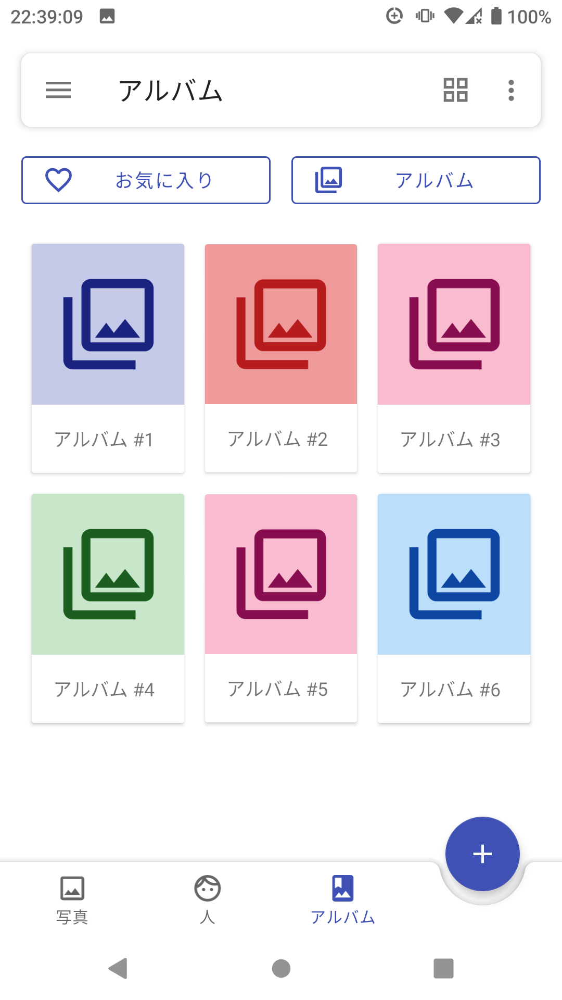
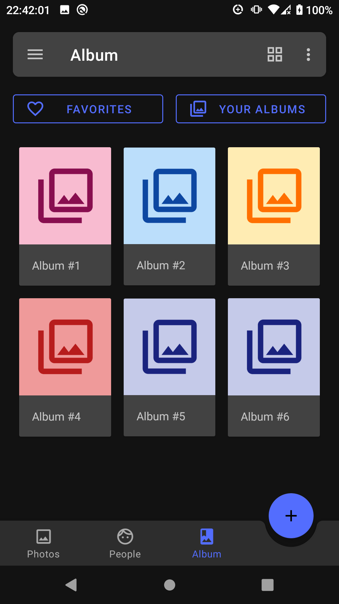

# Photos

<h4 align="center">A simple photo viewer application for Android mobile devices.</h4>

<p align="center">
    
    
    
    
    
    
</p>

<p align="center">
    
</p>

## Installation

Clone this repository and import into Android Studio
```
git clone git@github.com:qhuydo/18clc_10_doan.git
```

